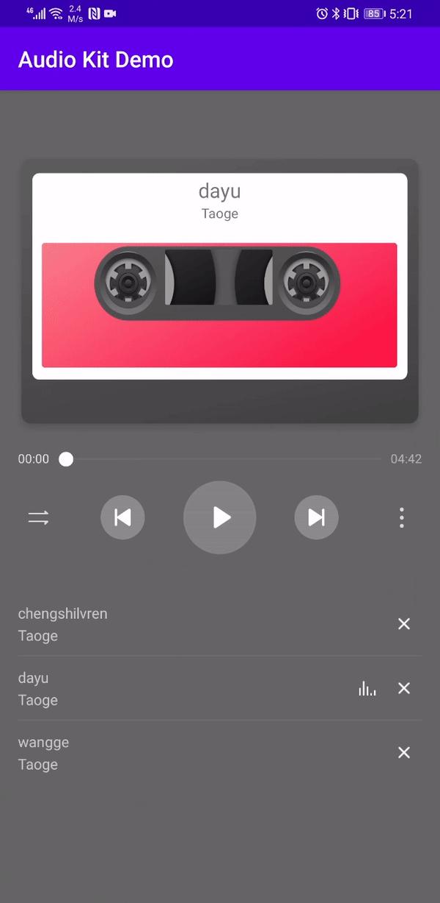

# HUAWEI Audio Kit Sample

English | [中文](README_ZH.md)

## Table of Contents

 * [Introduction](#introduction)
 * [Getting Started](#getting-started)
 * [Supported Environments](#supported-environments)
 * [Result](#result)
 * [Questions Or Issues](#question-or-issues)
 * [License](#license)

## Introduction
The sample code encapsulates APIs of HUAWEI Audio Kit for Android with many sample projects for your reference. It provides the following classes:

**HwAudioPlayerManager**: Controls audio playback (play, pause, skip back, skip next, stop, and drag the progress bar).

**HwAudioPlayItem**: Audio data class. Audio data includes the album name, artist, whether an audio file is online, and others.

**HwAudioQueueManager**: Manages audio queues, for example, deletes specified audio from a queue (playlist).
	
## Getting Started

1. Check Android studio environment. Open a sample project with the file "build.gradle" in Android Studio.

2. Register as a [HUAWEI developer](https://developer.huawei.com/consumer/en/?ha_source=hms1).

3. Create an app and configure the app information in AppGallery Connect. For details please refer to [Configuring App Information in AppGallery Connect](https://developer.huawei.com/consumer/en/doc/development/Media-Guides/introduction-0000001050749665?ha_source=hms1)

4. Import the demo into Android Studio (3.0 and later) before building it.

5. Run the test app on your Android device or an emulator.
	
## Supported Environments
Android SDK：21 and later versions 
JDK 1.8.211 and later versions

## Result
 

## Question or issues
If you want to evaluate more about HMS Core, [r/HMSCore on Reddit](https://www.reddit.com/r/HuaweiDevelopers/) is for you to keep up with latest news about HMS Core, and to exchange insights with other developers.

If you have questions about how to use HMS samples, try the following options:
- [Stack Overflow](https://stackoverflow.com/questions/tagged/huawei-mobile-services) is the best place for any programming questions. Be sure to tag your question with 
`huawei-mobile-services`.
- [Huawei Developer Forum](https://forums.developer.huawei.com/forumPortal/en/home?fid=0101187876626530001) HMS Core Module is great for general questions, or seeking recommendations and opinions.

If you run into a bug in our samples, please submit an [issue](https://github.com/HMS-Core/hms-audio-demo/issues) to the Repository. Even better you can submit a [Pull Request](https://github.com/HMS-Core/hms-audio-demo/pulls) with a fix.

##  License
HMS AudioKit Demo is licensed under the [Apache License, version 2.0](http://www.apache.org/licenses/LICENSE-2.0).
