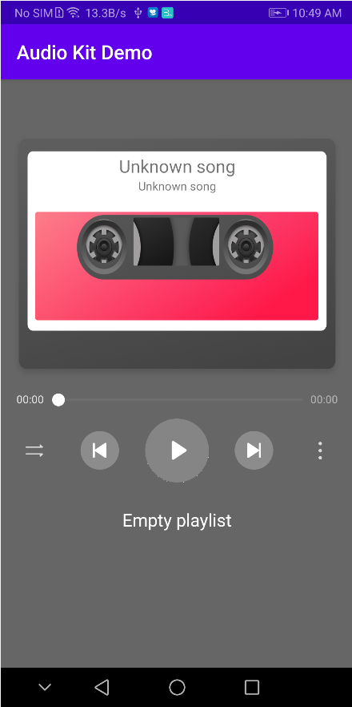
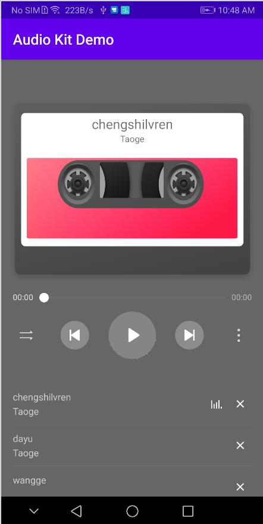

# HMS AudioKit Demo

## Table of Contents

 * [Introduction](#introduction)
 * [Getting Started](#getting-started)
 * [Supported Environments](#supported-environments)
 * [Result](#result)
 * [License](#license)
 

## Introduction
   AudioKit Android sample code encapsulates APIs of the HUAWEI Audio Kit. It provides many sample programs for your reference or usage.
   The following describes packages of Android sample code.

 HwAudioPlayerManager: Manages playback operations such as play, pause, skip back, skip next, stop, and drag the progress bar.
 
 HwAudioPlayItem: An audio data class. The data includes the album name, artist, whether an audio is online, and others.
 
 HwAudioQueueManager: Manages audio queues, for example, deletes a specified audio from a queue (playlist).
	
## Getting Started

   1. Check whether the Android studio development environment is ready. Open the sample code project directory with file "build.gradle" in Android Studio. Run TestApp on your divice or simulator which have installed latest Huawei Mobile Service(HMS).
   2. Register a [HUAWEI account](https://developer.huawei.com/consumer/en/).
   3. Create an app and configure the app information in AppGallery Connect. 
   See details: [HUAWEI Audio Service Development Preparation](https://developer.huawei.com/consumer/en/doc/development/HMSCore-Guides/introduction-0000001050749665)
   4. To build this demo, please first import the demo in the Android Studio (3.x+).
   5. Run the sample on your Android device or emulator.
	
	
## Supported Environments
   Android SDK Version >= 21 and JDK version >= 1.7 is recommended.

## Result
    

## Question or issues
If you want to evaluate more about HMS Core, [r/HMSCore on Reddit](https://www.reddit.com/r/HMSCore/) is for you to keep up with latest news about HMS Core, and to exchange insights with other developers.

If you have questions about how to use HMS samples, try the following options:
- [Stack Overflow](https://stackoverflow.com/questions/tagged/huawei-mobile-services) is the best place for any programming questions. Be sure to tag your question with 
**huawei-mobile-services**.
- [Huawei Developer Forum](https://forums.developer.huawei.com/forumPortal/en/home?fid=0101187876626530001) HMS Core Module is great for general questions, or seeking recommendations and opinions.

If you run into a bug in our samples, please submit an [issue](https://github.com/HMS-Core/hms-audio-demo/issues) to the Repository. Even better you can submit a [Pull Request](https://github.com/HMS-Core/hms-audio-demo/pulls) with a fix.

##  License
HMS AudioKit Demo is licensed under the [Apache License, version 2.0](http://www.apache.org/licenses/LICENSE-2.0).
